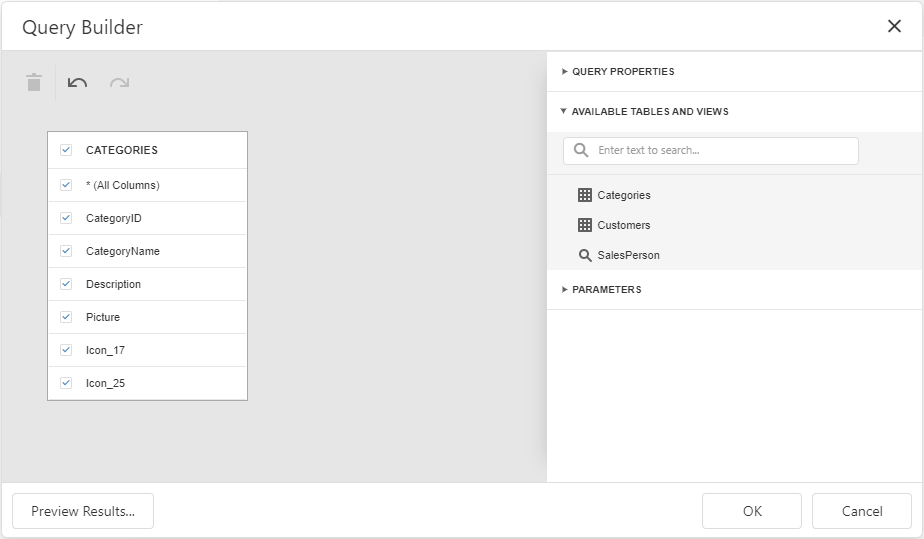
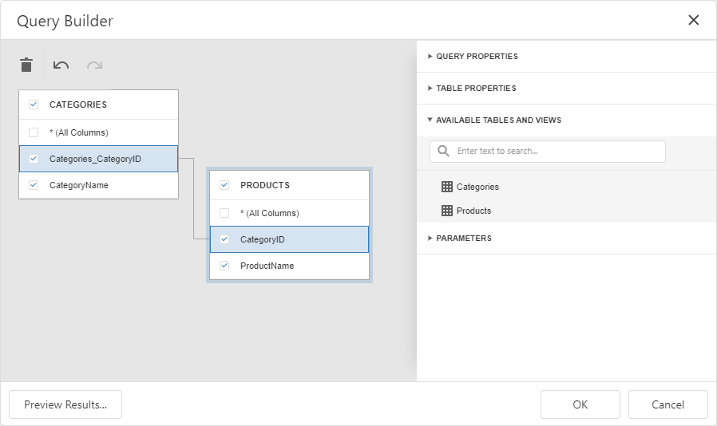

<!-- default badges list -->

<!-- default badges end -->

# Dashboard for MVC - How to customize a database schema for SQL data sources

This example shows how to create a custom database schema for the dashboard. The example contains two implementation of the [IDBSchemaProviderEx](https://docs.devexpress.com/CoreLibraries/DevExpress.DataAccess.Sql.IDBSchemaProviderEx) interface, `LimitDBSchemaProvider` and `ManualDBSchemaProvider`. Call the [DashboardConfigurator.SetDBSchemaProvider](https://docs.devexpress.com/Dashboard/DevExpress.DashboardWeb.DashboardConfigurator.SetDBSchemaProvider(DevExpress.DataAccess.Sql.IDBSchemaProviderEx)) method to assign the database schema to the Web Dashboard.

To see the result, add a new query or edit the existing query.

### The LimitDBSchemaProvider class

File: [LimitDBSchemaProvider.cs](./CS/MvcDashboard_CustomSchemaProvider/Code/LimitDBSchemaProvider.cs) (VB: [LimitDBSchemaProvider.vb](./VB/MvcDashboard_CustomSchemaProvider/Code/LimitDBSchemaProvider.vb))

This provider displays only the following database entities:

- Tables which names start with the letter *C*
- Views which names start with *Sales*
- Stored procedures with zero arguments

### The ManualDBSchemaProvider class

File: [ManualDBSchemaProvider.cs](./CS/MvcDashboard_CustomSchemaProvider/Code/ManualDBSchemaProvider.cs) (VB: [ManualDBSchemaProvider.vb](./VB/MvcDashboard_CustomSchemaProvider/Code/ManualDBSchemaProvider.vb))

This provider loads two tables (`Categories` and `Products`) for the `nwindConnection` connection. Both tables contain only two columns and the tables are linked by the `CategoryID` field.

This technique improves the [Data Source Wizard](https://docs.devexpress.com/Dashboard/117680/) performance when loading the database schema to the dashboard.

## Files to Look At

* [LimitDBSchemaProvider.cs](./CS/WebDashboardAspNetCore/Code/LimitDBSchemaProvider.cs) (VB: [LimitDBSchemaProvider.vb](./VB/MvcDashboard_CustomSchemaProvider/Code/LimitDBSchemaProvider.vb))
* [ManualDBSchemaProvider.cs](./CS/WebDashboardAspNetCore/Code/ManualDBSchemaProvider.cs) (VB: [ManualDBSchemaProvider.vb](./VB/MvcDashboard_CustomSchemaProvider/Code/ManualDBSchemaProvider.vb))
* [DashboardConfig.cs](/CS/MvcDashboard_CustomSchemaProvider/App_Start/DashboardConfig.cs) (VB: [DashboardConfig.vb](./VB/MvcDashboard_CustomSchemaProvider/App_Start/DashboardConfig.vb))

## Documentation

* [IDBSchemaProviderEx](https://docs.devexpress.com/CoreLibraries/DevExpress.DataAccess.Sql.IDBSchemaProviderEx)

## More Examples

* [Dashboard for ASP.NET Core - How to customize a database schema for SQL data sources](https://github.com/DevExpress-Examples/asp-net-core-dashboard-custom-database-schema-for-sql-data-sources)
* [Dashboard for MVC - How to implement multi-tenant Dashboard architecture
](https://github.com/DevExpress-Examples/DashboardUserBasedMVC)

